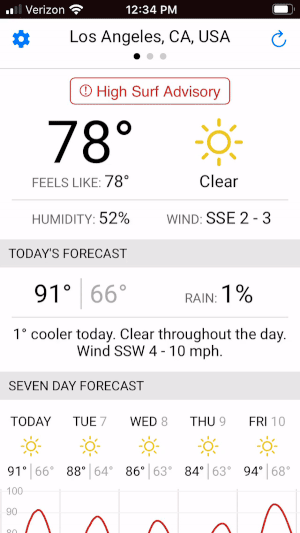
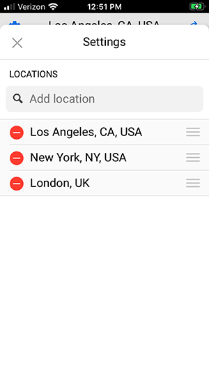

# Bright Sky

 

Bright Sky is a [Progressive Web App](https://developer.mozilla.org/en-US/docs/Web/Progressive_web_apps) that displays current weather conditions, today's forecast, weather alerts, and a seven-day graphical forecast - all with support for multiple geographic locations.

The Bright Sky user interface is a mobile-first design optimized for phone screens in portrait orientation.

## API Notes

This app uses the following APIs:

- [Dark Sky](https://darksky.net/dev/docs)
- [Google Maps Place Autocomplete](https://developers.google.com/places/web-service/autocomplete)
- [Google Maps Place Details](https://developers.google.com/places/web-service/details)

If you want to build and run this app, you will first need to do the following:

1. Register for each of these APIs and get an API Key.
2. Set up a proxy for each of these APIs.
3. Modify each URL in `src/config.ts` to point to your proxy.

The reason you need a proxy is that these APIs all prevent cross-origin resource sharing (CORS). Therefore, the proxy has to set the CORS `access-control-allow-origin` response header, or you will get an error when the client side code tries to call the API. The proxy should also be configured to specify your API Key, so that the key isn't exposed by your client side code.

There are many ways to set up a proxy; since I use Amazon Web Services (AWS) for hosting, I found it convenient to create my proxies in the AWS API Gateway service.

## License

The MIT License

Copyright 2020 Rand Scullard
